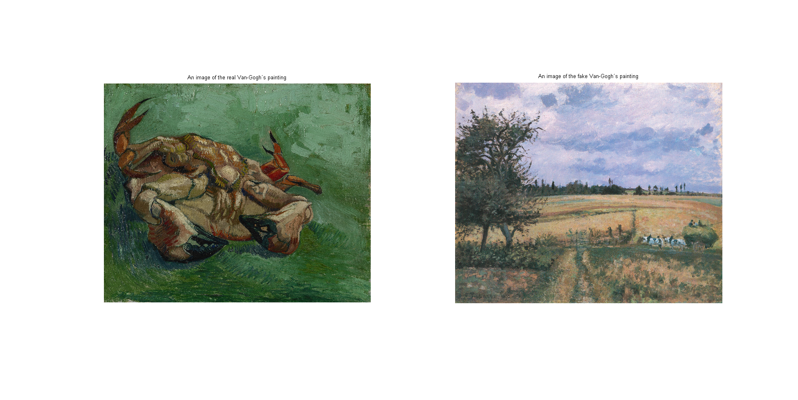

# Image-Classification
Image classification  using Gabor Filter Bank
---
## Here left one is original Van Gogh's painting and right one is fake Van Goghs Painting

##The Gabor Filter bank(24 filter have been used to extract the feature: which gives 24 dimensional feature vector for each image

