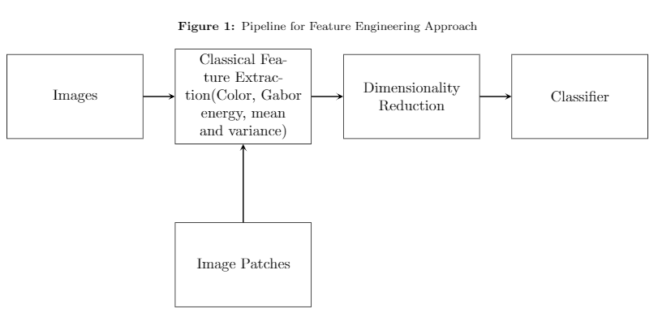
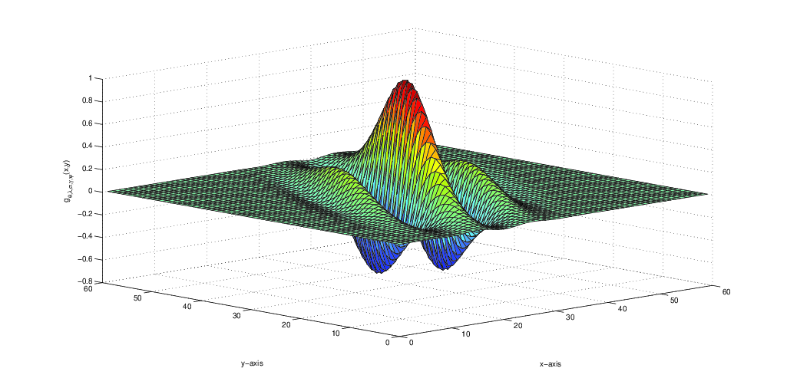
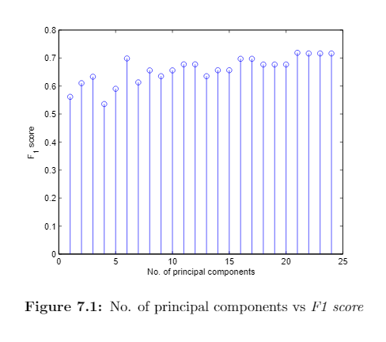

# Image-Classification
Image classification  using Gabor Filter Bank
---
#Pipeline of the project

#Dataset:: VGDB-2016

## Here left one is original Van Gogh's painting and right one is fake Van Goghs Painting

##The Gabor Filter bank(24 filter have been used to extract the feature: which gives 24 dimensional feature vector for each image

Performance metric:: F1-score
##Result as a f1-score for each dimension (best result we have got 71.87% for first 21-principal components)

